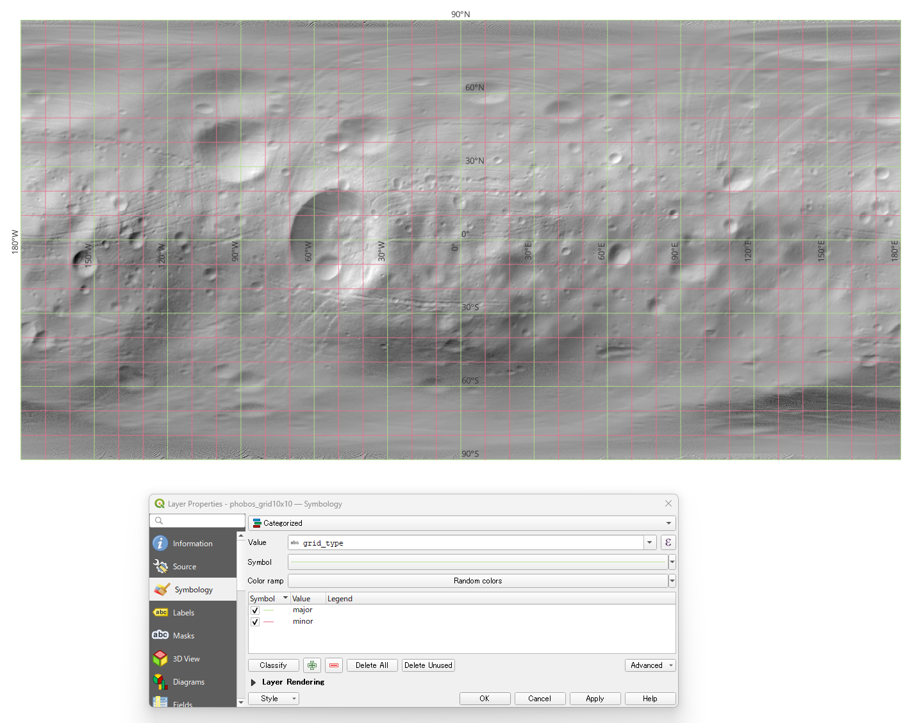
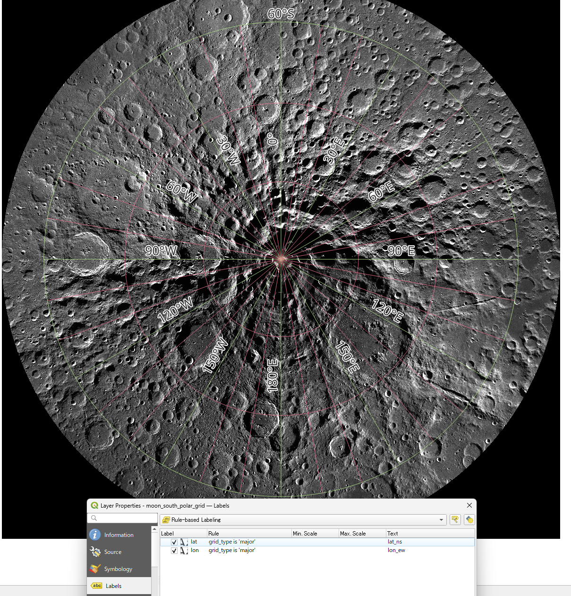

# mkgraticule_planet
[](https://doi.org/10.5281/zenodo.18864189)  
Create planetary graticules for **IAU coordinate systems** and export them as **GeoPackage**.

A small CLI utility for generating latitude/longitude grids for planetary bodies using **IAU 2015 planetary coordinate systems**.

## Features

* Supports **IAU 2015 planetary coordinate systems**
* GeoPackage output
* Compatible with **GDAL 3.x**
* Multiple graticule label styles
* QGIS-friendly output suitable for map production: label fields allow immediate graticule labeling, and CRS metadata ([`definition_12_063`](https://www.geopackage.org/spec/#gpkg_spatial_ref_sys_cols_crs_wkt)) ensures that IAU coordinate systems are correctly recognized when the GeoPackage is loaded in QGIS.
* Optional major/minor classification via `-m/--major` (`grid_type = major|minor`, otherwise NULL)
* Safer handling for projected CRS with limited domains:
  * abort on projected + near-global extent unless `-s/--skipfailures` is used
  * optional `-p/--partial-reprojection` for partial output near projection-domain limits
* Optional dateline de-duplication for near-global longitude ranges: `-ndd/--no-duplicate-dateline`

Latitude labels:

* `lat_180` → -90° to 90°
* `lat_ns` → 90°S to 90°N

Longitude labels:

* `lon_180` → -180° to 180°
* `lon_ew` → 180°W to 180°E
* `lon_360` → 0° to 360°

## Requirements

Python with GDAL Python bindings.

Example installation (conda):

```sh
conda install gdal
```

## Usage

### Basic example

```sh
# Moon
python mkgraticule_planet.py -g 10 10 \
                             -r 0.2 0.2 \
                             -srs IAU_2015:30100 \
                             -e -180 90 180 -90 \
                             moon_graticule.gpkg

# Mars
python mkgraticule_planet.py -g 15 15 \
                             -r 0.5 0.5 \
                             -srs IAU_2015:49900 \
                             mars_graticule.gpkg
```
### Major/minor graticules

```sh
python mkgraticule_planet.py -g 10 10 \
                             -m 30 30 \
                             -srs IAU_2015:40100 \
                             -e -180 90 180 -90 \
                             phobos_graticule.gpkg
```
If `-m/--major` is set: `grid_type` will be `"major"` or `"minor"`.
If omitted: `grid_type` is NULL.

## Projected CRS considerations

Some projected coordinate systems (e.g., polar stereographic) have **limited valid domains**.
If a near-global geographic extent is requested, reprojection may fail.

- Default behavior: **abort** with a message suggesting to restrict the extent with `-e`
- Recommended approach: restrict the geographic extent to the valid projection domain (e.g., `-e -180 -60 180 -90` for south polar views)
- To force output anyway (skip features that fail reprojection): `-s/--skipfailures`
- Optionally enable partial reprojection: `-p/--partial-reprojection`

For projected + near-global requests, restricting the extent with `-e` is usually the best solution.  
Combining `-s` with `-p` can sometimes produce partial output near projection domain limits.

### Dateline handling

If the longitude span is approximately **360°** (e.g. `-180..180`), both `-180` and `180` meridians can be generated.

To drop the duplicate dateline meridian (remove `-180` and keep `180`):

```sh
python mkgraticule_planet.py ... -ndd
```

## Planetary CRS

The `-srs` option accepts any coordinate reference system supported by GDAL / PROJ.

Planetary coordinate systems typically follow the **IAU 2015 cartographic coordinate system definitions**.
Many IAU CRS codes can be browsed at:

https://spatialreference.org/

Example codes:

- `IAU_2015:30100` — Moon
- `IAU_2015:49900` — Mars
- `IAU_2015:40100` — Phobos

## Example (QGIS)

### Example graticule generated for **Phobos** using major/minor classification.
Command:

```sh
python mkgraticule_planet.py -srs IAU_2015:40100 -g 10 10 phobos_grid10x10 -m 30 30
```



### QGIS example: Moon south polar stereographic

Example graticule generated for the **Moon south polar stereographic projection**  
(`IAU_2015:30135`).

Because polar stereographic projections have a **limited valid domain**,  
the geographic extent is restricted to the south polar region.

Command:

```sh
python mkgraticule_planet.py -srs IAU_2015:30135 \
                             -g 10 1 \
                             -m 30 2 \
                             -e -180 -80 180 -90 -ndd \
                             moon_south_pole_graticule.gpkg
```



## Output fields

| Field   | Description                     |
| ------- | ------------------------------- |
| fid     | feature id                      |
| lat     | latitude value                  |
| lon     | longitude value                 |
| lat_180 | latitude label (-90° … 90°)     |
| lat_ns  | latitude label (90°S … 90°N)    |
| lon_180 | longitude label (-180° … 180°)  |
| lon_ew  | longitude label (180°W … 180°E) |
| lon_360 | longitude label (0° … 360°)     |
| grid_type | `"major"` / `"minor"` when `--major` is used (otherwise NULL) |

## Acknowledgement

This project is based on the GDAL sample script:

https://github.com/OSGeo/gdal/blob/master/swig/python/gdal-utils/osgeo_utils/samples/mkgraticule.py

## Citation

If you use this software in your research, please cite:

Hemmi, R. (2026). *mkgraticule_planet*. Zenodo.  
https://doi.org/10.5281/zenodo.18864189

## License

MIT License. See the LICENSE file for details.


