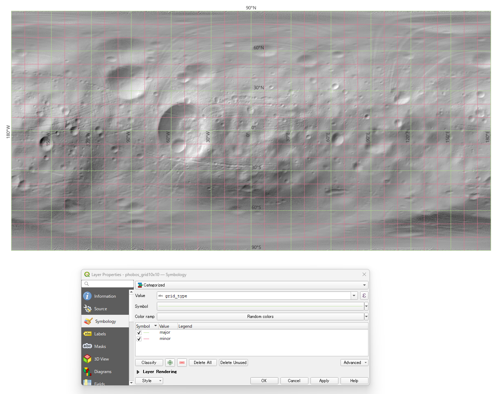
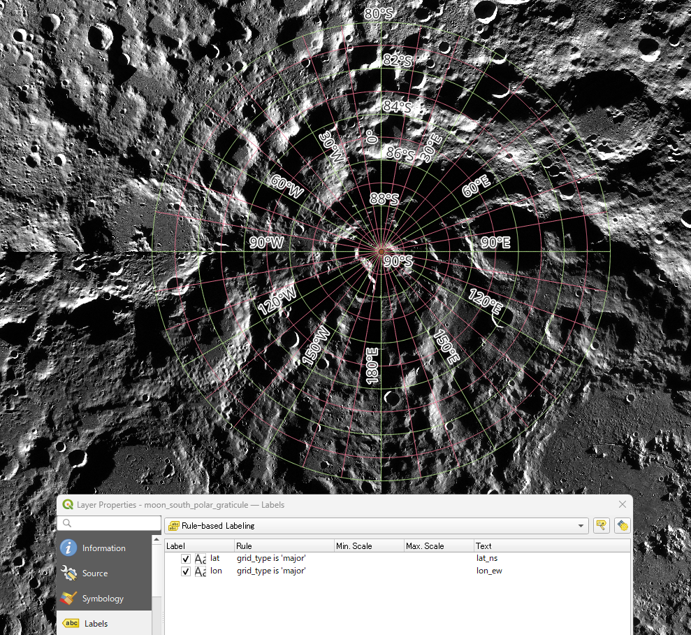
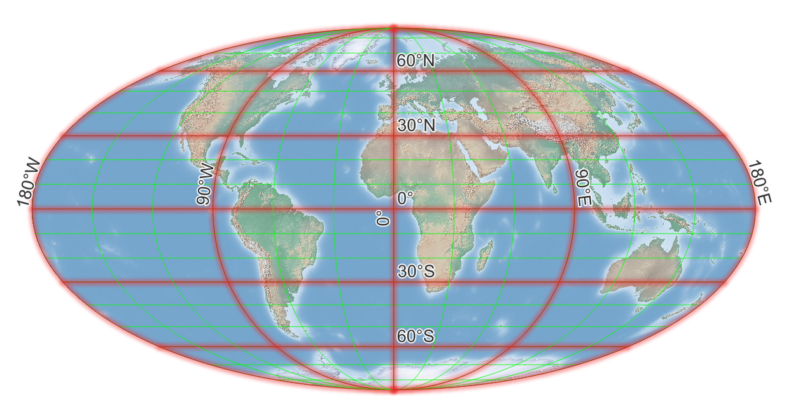
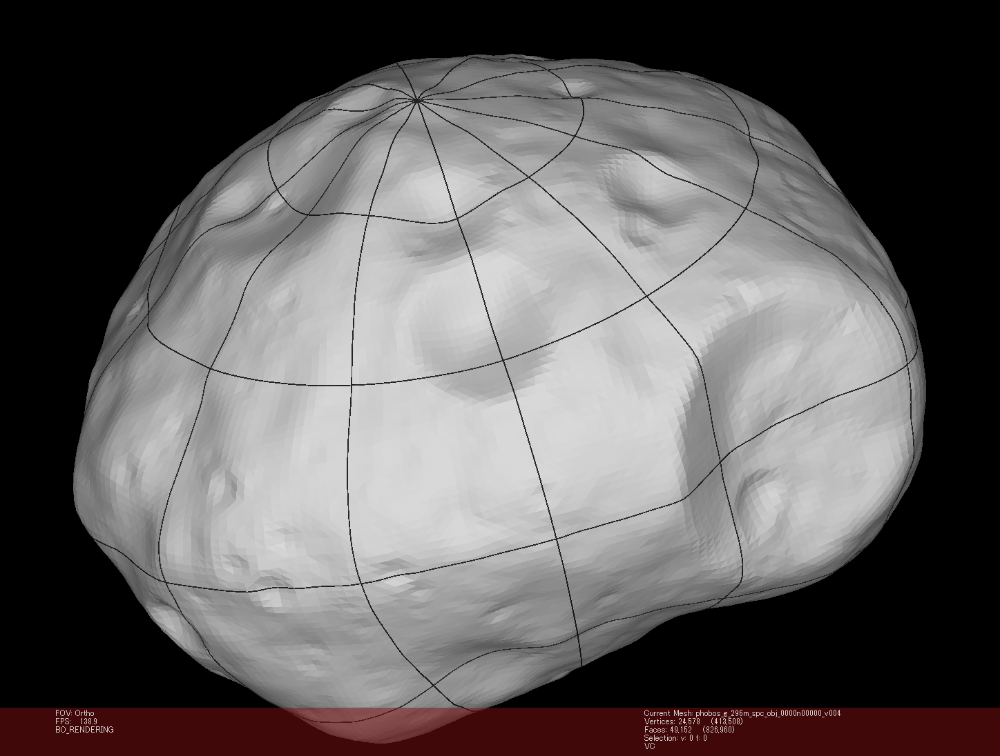

# mkgraticule_planet
[](https://anaconda.org/conda-forge/mkgraticule-planet)  
Create planetary-scale graticules with multi-format labels for any **GDAL/PROJ-supported CRS** — exported as **GeoPackage**, **SpatiaLite**, or Python-only fitted **3D PLY**.

A small CLI utility for generating latitude/longitude grids for planetary bodies using **IAU 2015 planetary coordinate systems**.

Currently, two CLI implementations are available:

* **Python / GDAL**: [`mkgraticule_planet.py`](/standalone/mkgraticule_planet.py)
* **R / sf**: [`mkgraticule_planet.R`](/standalone/mkgraticule_planet.R)

The fitted 3D PLY output for OBJ/mesh shape models is available in the Python implementation only.

## Table of Contents

- [Why two implementations?](#why-two-implementations)
- [Features](#features)
- [Installation](#installation)
- [Design notes](#design-notes)
- [Why Shapefile and GeoJSON export are not supported](#why-shapefile-and-geojson-export-are-not-supported)
- [Usage](#usage)
- [Projected CRS considerations](#projected-crs-considerations)
- [Planetary CRS](#planetary-crs)
- [QGIS examples](#qgis-examples)
- [Output fields](#output-fields)
- [3D PLY fitted to an OBJ shape model (Python only)](#3d-ply-fitted-to-an-obj-shape-model-python-only)
- [Acknowledgement](#acknowledgement)
- [Citation](#citation)
- [License](#license)

## Why two implementations?

- Python version for [GDAL](https://github.com/OSGeo/gdal)-centric workflows
- R version for [sf (Simple Features for R)](https://github.com/r-spatial/sf/)-centric workflows

## Features

* Supports **IAU 2015 planetary coordinate systems**
* GeoPackage and SpatiaLite output
* Python-only fitted 3D PLY output for OBJ/mesh shape models
* Compatible with **GDAL 3.x**
* Available as both **GDAL Python** and **R sf** implementations for 2D GIS output
* Multiple graticule label styles
* QGIS-friendly output suitable for map production: label fields allow immediate graticule labeling, and CRS metadata ([`definition_12_063`](https://www.geopackage.org/spec/#gpkg_spatial_ref_sys_cols_crs_wkt)) ensures that IAU coordinate systems are correctly recognized when the GeoPackage is loaded in QGIS (GeoPackage only).
* Optional major/minor classification via `-m/--major` (`grid_type = major|minor`, otherwise NULL)
* Safer handling for projected CRS with limited domains:
  * abort on projected + near-global extent unless `-s/--skipfailures` is used
  * optional `-p/--partial-reprojection` for partial output near projection-domain limits
* Override Lambert Conic Conformal projection parameters via `-lo` (latitude of origin), `-ls` (1st standard parallel), and `-ls2` (2nd standard parallel), allowing customization of the IAU defaults (0°, 20°, 60°)
* Optional endpoint de-duplication for 360° longitude spans: `-nde/--no-duplicate-endpoint`
* Automatic companion point layer (`point`) for projected CRS:
  * collapsed graticule features at projection singularities
  * projection-center label points
* Point-role classification in the companion point layer via `point_role` (`collapsed` / `center`)

Latitude labels:

* `lat_90` → -90° to 90°
* `lat_ns` → 90°S to 90°N

Longitude labels:

* `lon_180` → -180° to 180°
* `lon_ew` → 180°W to 180°E
* `lon_360` → 0° to 360°
* `lon_360e` → 0° to 360°E
* `lon_360w` → 0° to 360°W

## Installation

### Python implementation

#### Option 1: conda install (recommended)

```sh
conda install -c conda-forge mkgraticule-planet
```

Or install directly into a new dedicated environment:

```sh
conda create -y -n myenv mkgraticule-planet -c conda-forge
conda activate myenv
```

With conda 4.4 or newer (Dec 2017), the shorter `channel::package` form is also valid:

```sh
conda create -y -n myenv conda-forge::mkgraticule-planet
conda activate myenv
```

> **Note:** GDAL does not provide pre-built wheels on PyPI, so `pip install` cannot
> resolve the GDAL dependency reliably. Installing via conda is recommended.

#### Option 2: Use standalone scripts directly

The [`standalone/`](/standalone/) directory contains self-contained single-file scripts for both Python and R. No package installation is required beyond the runtime libraries -- just download or clone and run.

These work in any environment where GDAL (Python) or sf (R) is already available:

- **Your existing conda environment** with `gdal` (Python), plus `trimesh rtree` and an Embree binding for Python PLY output, or `r-base r-sf r-rsqlite r-dbi` (R)
- **OSGeo4W Shell** bundled with QGIS (GDAL is pre-installed)
- Any other setup with the required libraries

```sh
# Clone and run
git clone https://github.com/ryodohemmi/mkgraticule_planet.git
python standalone/mkgraticule_planet.py --help
Rscript standalone/mkgraticule_planet.R --help
```

Or download a single file directly:

```sh
# Python
curl -O https://raw.githubusercontent.com/ryodohemmi/mkgraticule_planet/main/standalone/mkgraticule_planet.py
python mkgraticule_planet.py --help

# R
curl -O https://raw.githubusercontent.com/ryodohemmi/mkgraticule_planet/main/standalone/mkgraticule_planet.R
Rscript mkgraticule_planet.R --help
```

If you need to set up a fresh conda environment:

```sh
# Python
conda create -n myenv -c conda-forge gdal trimesh rtree
conda activate myenv

# R
conda create -n rsf -c conda-forge r-base r-sf r-rsqlite r-dbi
conda activate rsf
```

An equivalent environment file for Python PLY workflows is available at [`docs/setup/phobos-latlon-grid.yml`](docs/setup/phobos-latlon-grid.yml):

```sh
conda env create -f docs/setup/phobos-latlon-grid.yml
conda activate phobos-latlon-grid
```

Embree acceleration is strongly recommended for shape-model PLY output. The `trimesh`/`rtree` fallback is useful for small jobs, but can require very large temporary arrays on irregular meshes. As of May 2026, `pip install embreex` is the recommended Embree path for current Python versions.

```sh
pip install embreex
```

`pyembree` is also available from conda-forge, but its package builds may lag behind current Python versions:

```sh
conda install -c conda-forge pyembree
```

#### Option 3: Install from source (for development)

```sh
git clone https://github.com/ryodohemmi/mkgraticule_planet.git
cd mkgraticule_planet
conda create -n myenv -c conda-forge gdal trimesh rtree
conda activate myenv
pip install -e .
```

For a compact summary of conda download size and post-install environment size for both implementations, see [docs/setup/conda-env-size-summary-2026-03-17.md](docs/setup/conda-env-size-summary-2026-03-17.md).

## Design notes

For the rationale behind the graticule-generation workflow and a comparison with QGIS-native projected-grid tools and `sf::st_graticule()`, see [docs/design/comparison-with-qgis-and-sf.md](docs/design/comparison-with-qgis-and-sf.md).

## Why Shapefile and GeoJSON export are not supported

`mkgraticule_planet` does not support direct Shapefile or GeoJSON export by design.

Shapefile is still widely supported, but it is an old multi-file format with strict field-name limits, fragile character encoding behavior, file-size constraints, and weak self-contained metadata handling. These issues are especially undesirable for planetary GIS data, where the coordinate reference system should be preserved clearly and unambiguously. If Shapefile output is required for legacy software, export a GeoPackage first and convert it with GDAL/OGR:

For background on Shapefile limitations, see [Switch from Shapefile](http://switchfromshapefile.org/).

```sh
ogr2ogr -f "ESRI Shapefile" output_shapefile input.gpkg
```

That conversion may lose or degrade metadata, field names, encoding information, or CRS handling depending on the target software.

GeoJSON is also not supported as a primary output format because RFC 7946 GeoJSON is defined for geographic coordinates in WGS 84 / CRS84, and support for alternative coordinate reference systems was removed from the specification. That is a poor fit for planetary coordinate systems based on IAU definitions: writing Mars, Moon, or other planetary coordinates as ordinary GeoJSON could incorrectly imply Earth-based WGS 84 coordinates, or produce non-standard GeoJSON that different software may interpret inconsistently.

For this reason, the 2D GIS outputs focus on formats that preserve CRS information more explicitly: GeoPackage (`.gpkg`) for most users and SpatiaLite (`.sqlite`) for SQLite-based spatial workflows.

## Usage

After installation, the recommended command is:

```sh
mkgraticule --help
```

For compatibility, the longer command is also available:

```sh
mkgraticule_planet --help
```

You can also run via `python -m`:

```sh
python -m mkgraticule_planet --help
```

When running standalone scripts from a cloned repository, use the files in `standalone/`:

Output filenames may be specified either with or without the `.gpkg` extension. If the extension is omitted, it is added automatically.

The output format is auto-detected from the file extension:

| Extension | Format |
| --------- | ------ |
| `.gpkg` (default) | GeoPackage |
| `.sqlite` / `.sqlite3` / `.spatialite` | SpatiaLite |
| `.ply` | Python-only fitted 3D PLY |

To override auto-detection, use `-f/--format`:

```sh
python mkgraticule_planet.py -f spatialite ... out.db
```

The `-e` option specifies the geographic extent in the order: `xmin ymax xmax ymin` ("ullr" style).

### Basic example

> **Note:** Examples are provided in two forms:
> - **(conda)** — use the `mkgraticule` command after `conda install -c conda-forge mkgraticule-planet`.
>   `mkgraticule_planet` is also available as a compatibility alias.
> - **(standalone)** — run the single-file script directly with `python mkgraticule_planet.py ...`
>   or `Rscript mkgraticule_planet.R ...`.
>
> R has no conda-forge package yet, so only the standalone form is shown for R.

#### Python / GDAL (conda)
```sh
# Moon
mkgraticule -g 10 10 \
            -r 0.2 0.2 \
            -srs IAU_2015:30100 \
            -e -180 90 180 -90 \
            moon_graticule.gpkg

# Mars
mkgraticule -g 15 15 \
            -r 0.5 0.5 \
            -srs IAU_2015:49900 \
            mars_graticule.gpkg
```
#### Python / GDAL (standalone)
```sh
# Moon
python mkgraticule_planet.py -g 10 10 \
                             -r 0.2 0.2 \
                             -srs IAU_2015:30100 \
                             -e -180 90 180 -90 \
                             moon_graticule.gpkg

# Mars
python mkgraticule_planet.py -g 15 15 \
                             -r 0.5 0.5 \
                             -srs IAU_2015:49900 \
                             mars_graticule.gpkg
```
#### R / sf (standalone)
```sh
# Moon
Rscript mkgraticule_planet.R -g 10 10 \
                             -r 0.2 0.2 \
                             -srs IAU_2015:30100 \
                             -e -180 90 180 -90 \
                             moon_graticule.gpkg

# Mars
Rscript mkgraticule_planet.R -g 15 15 \
                             -r 0.5 0.5 \
                             -srs IAU_2015:49900 \
                             mars_graticule.gpkg
```
### Major/minor graticules
#### Python / GDAL (conda)
```sh
mkgraticule -g 10 10 \
            -m 30 30 \
            -srs IAU_2015:40100 \
            -e -180 90 180 -90 \
            phobos_graticule.gpkg
```
If `-m/--major` is set: `grid_type` will be `"major"` or `"minor"`.
If omitted: `grid_type` is NULL.
#### Python / GDAL (standalone)
```sh
python mkgraticule_planet.py -g 10 10 \
                             -m 30 30 \
                             -srs IAU_2015:40100 \
                             -e -180 90 180 -90 \
                             phobos_graticule.gpkg
```
#### R / sf (standalone)
```sh
Rscript mkgraticule_planet.R -g 10 10 \
                             -m 30 30 \
                             -srs IAU_2015:40100 \
                             -e -180 90 180 -90 \
                             phobos_graticule.gpkg
```

## Projected CRS considerations

Some projected coordinate systems (e.g., polar stereographic) have **limited valid domains**.
If a near-global geographic extent is requested, reprojection may fail.

- Default behavior: **abort** with a message suggesting to restrict the extent with `-e`
- Recommended approach: restrict the geographic extent to the valid projection domain (e.g., `-e -180 -60 180 -90` for south polar views)
- To force output anyway (skip features that fail reprojection): `-s/--skipfailures`
- Optionally enable partial reprojection: `-p/--partial-reprojection`

For projected + near-global requests, restricting the extent with `-e` is usually the best solution.  
Combining `-s` with `-p` can sometimes produce partial output near projection domain limits.

For projections with a singular center, the tool also writes a companion point layer (`point`).  
This layer can contain:

- `collapsed` points for graticule features that collapse to a single point in the projected CRS
- `center` points for projection-center label points

This makes it possible to label features such as `90°S`, `90°N`, or a projection-center graticule label in QGIS even when the corresponding line geometry is not visible.

### Dateline handling

If the longitude span is approximately **360°** (e.g. `-180..180` or `0..360`), duplicate endpoint meridians can be generated.

To drop the duplicate endpoint meridian while keeping the minimum longitude endpoint:

- `-180..180` → keep `-180`, drop `180`

- `0..360` → keep `0`, drop `360`

```sh
mkgraticule ... -nde
```

## Planetary CRS

The `-srs` option accepts any coordinate reference system supported by GDAL / PROJ.

Planetary coordinate systems typically follow the **IAU 2015 cartographic coordinate system definitions**.
Many IAU CRS definitions can be browsed at:

https://spatialreference.org/

Example codes:

- `IAU_2015:30100` — Moon
- `IAU_2015:49900` — Mars
- `IAU_2015:40100` — Phobos

## QGIS examples

### Phobos example (with major/minor classification)

Example global graticule for **Phobos**, generated using major/minor classification.

Command:

```sh
mkgraticule -srs IAU_2015:40100 \
            -g 10 10 -m 30 30 \
            phobos_grid10x10
```



### Moon south polar stereographic example

Example graticule generated for the **Moon south polar stereographic projection**  
(`IAU_2015:30135`).

Because polar stereographic projections have a **limited valid domain**,  
the geographic extent is restricted to the south polar region.  
The `-nde` option is used to remove the duplicate endpoint meridian.

For this type of projection, the tool also writes a companion point layer (`point`), which can be used to display labels such as `90°S` at the projection center in QGIS.

Command:

```sh
mkgraticule -srs IAU_2015:30135 \
            -g 10 1 -m 30 2 \
            -e -180 -80 180 -90 -nde \
            moon_south_pole_graticule.gpkg
```



### Earth Mollweide example

Example global graticule for the **Earth** using the **World Mollweide projection**  
(`ESRI:54009`).

This example shows that the tool can also be used with non-IAU coordinate reference systems supported by GDAL / PROJ.

Command:

```sh
mkgraticule -srs ESRI:54009 \
            -g 30 10 \
            -m 90 30 \
            -e -180 90 180 -90 \
            earth_mollweide_graticule.gpkg
```



## Output fields

### Main graticule layer

| Field      | Description |
| ---------- | ----------- |
| fid        | feature id |
| lat        | latitude value |
| lon        | longitude value |
| lat_90     | latitude label (-90° … 90°) |
| lat_ns     | latitude label (90°S … 90°N) |
| lon_180    | longitude label (-180° … 180°) |
| lon_ew     | longitude label (180°W … 180°E) |
| lon_360    | longitude label (0° … 360°) |
| lon_360e   | longitude label (0° … 360°E) |
| lon_360w   | longitude label (0° … 360°W) |
| grid_type  | `"major"` / `"minor"` when `--major` is used (otherwise NULL) |

### Companion point layer (`point`)

| Field      | Description |
| ---------- | ----------- |
| fid        | feature id |
| lat        | latitude value, when applicable |
| lon        | longitude value, when applicable |
| lat_90     | latitude label (-90° … 90°) |
| lat_ns     | latitude label (90°S … 90°N) |
| lon_180    | longitude label (-180° … 180°) |
| lon_ew     | longitude label (180°W … 180°E) |
| lon_360    | longitude label (0° … 360°) |
| lon_360e   | longitude label (0° … 360°E) |
| lon_360w   | longitude label (0° … 360°W) |
| point_role | point role: `collapsed` or `center` |

## 3D PLY fitted to an OBJ shape model (Python only)

PLY output ray-casts latitude/longitude samples onto the input mesh. It assumes the mesh is centered on `--origin` and uses `+X = lon 0`, `+Y = lon 90E`, and `+Z = north`.

The existing grid options are reused:

- `-g xstep ystep`: meridian and parallel spacing in degrees
- `-r xres yres`: longitude sampling for parallels and latitude sampling for meridians
- `-e xmin ymax xmax ymin`: longitude/latitude range to fit

Install an Embree binding for the fast ray path; as of May 2026, `pip install embreex` is recommended for current Python versions. Without Embree, the Python CLI uses the default `trimesh`/`rtree` ray intersector only for small jobs; larger jobs fail fast before ray casting because the fallback can allocate very large candidate arrays on irregular shape models. Pass `--allow-slow-raycast` only if you intentionally want to force that fallback.

### Python / GDAL (conda)
```sh
mkgraticule -f ply \
            --input-mesh phobos_shape.obj \
            -g 10 10 \
            -r 1 1 \
            -e 0 90 360 -90 \
            --offset-fraction 0.0005 \
            phobos_graticule_3d.ply
```

### Python / GDAL (standalone)
```sh
python mkgraticule_planet.py -f ply \
                             --input-mesh phobos_shape.obj \
                             -g 10 10 \
                             -r 1 1 \
                             -e 0 90 360 -90 \
                             --tube-radius 0.001 \
                             phobos_graticule_3d.ply
```

`--tube-radius` writes a colored tube mesh instead of PLY edge primitives. PLY-specific command-line options are marked with `[PLY only]` in `--help`.

### Phobos MeshLab render example

The image below shows a 30-degree fitted PLY tube graticule rendered in MeshLab on top of `phobos_g_296m_spc_obj_0000n00000_v004.obj`.

```sh
python standalone/mkgraticule_planet.py \
  --mesh phobos_g_296m_spc_obj_0000n00000_v004.obj \
  -g 30 30 \
  --offset-distance 0.005 \
  --tube-radius 0.02 \
  --tube-segments 8 \
  --color 40,40,40 \
  phobos_latlon_30deg_tube_r002_o005.ply
```



## Acknowledgement

This project is based on the GDAL sample script:

https://github.com/OSGeo/gdal/blob/master/swig/python/gdal-utils/osgeo_utils/samples/mkgraticule.py

The R implementation was developed as an `sf`-based companion workflow for the same `mkgraticule_planet` concept.

## Citation

If you use this software in your research, please cite:

Hemmi, R. (2026). *mkgraticule_planet*. Zenodo.  
https://doi.org/10.5281/zenodo.18864189

## License

Apache-2.0 License. See [LICENSE](/LICENSE) for details.
