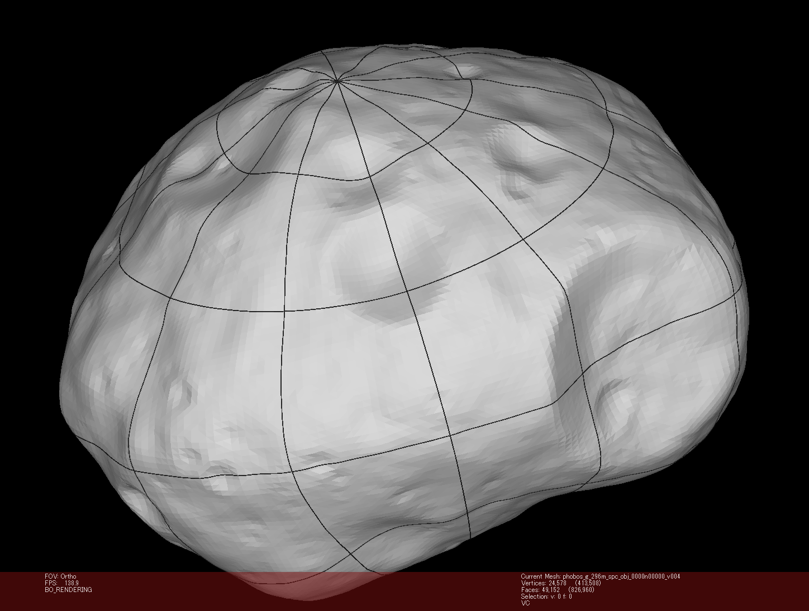

# 3D PLY fitted to an OBJ shape model (Python only)

PLY output ray-casts latitude/longitude samples onto the input mesh. It assumes the mesh is centered on `--ray-orig` / `-rorig` and uses `+X = lon 0`, `+Y = lon 90E`, and `+Z = north`.

The existing grid options are reused:

- `-g xstep ystep`: meridian and parallel spacing in degrees
- `-r xres yres`: longitude sampling for parallels and latitude sampling for meridians
- `-e xmin ymax xmax ymin`: longitude/latitude range to fit

Examples below use the short PLY aliases. Use `--offset-distance` / `-odist` for an absolute outward offset, or `--offset-fraction` / `-ofrac` for an offset relative to the mesh radius; these two offset options are mutually exclusive.

Install an Embree binding for the fast ray path; as of May 2026, `pip install embreex` is recommended for current Python versions. Without Embree, the Python CLI uses the default `trimesh`/`rtree` ray intersector only for small jobs; larger jobs fail fast before ray casting because the fallback can allocate very large candidate arrays on irregular shape models. Pass `--ray-slow` / `-rslow` only if you intentionally want to force that fallback.

!!! note
    `-u meters` and `-q/--qview` are not available for PLY output.

=== "Python / GDAL (conda)"

    ```sh
    mkgraticule -f ply \
                -mesh phobos_shape.obj \
                -g 10 10 \
                -r 1 1 \
                -e 0 90 360 -90 \
                -odist 0.005 \
                phobos_graticule_3d.ply
    ```

=== "Python / GDAL (standalone)"

    ```sh
    python mkgraticule_planet.py -f ply \
                                 -mesh phobos_shape.obj \
                                 -g 10 10 \
                                 -r 1 1 \
                                 -e 0 90 360 -90 \
                                 -odist 0.005 \
                                 -trad 0.001 \
                                 phobos_graticule_3d.ply
    ```

`--tube-rad` / `-trad` writes a colored tube mesh instead of PLY edge primitives. PLY-specific command-line options are marked with `[PLY only]` in `--help`.

## Phobos MeshLab render example

The image below shows a 30-degree fitted PLY tube graticule rendered in MeshLab on top of [`phobos_g_296m_spc_obj_0000n00000_v004.obj`](https://sbmt.jhuapl.edu/shared-files/files/).

```sh
python standalone/mkgraticule_planet.py \
  -mesh phobos_g_296m_spc_obj_0000n00000_v004.obj \
  -g 30 30 \
  -odist 0.005 \
  -trad 0.02 \
  -tseg 8 \
  -prgb 40,40,40 \
  phobos_latlon_30deg_tube_r002_o005.ply
```


