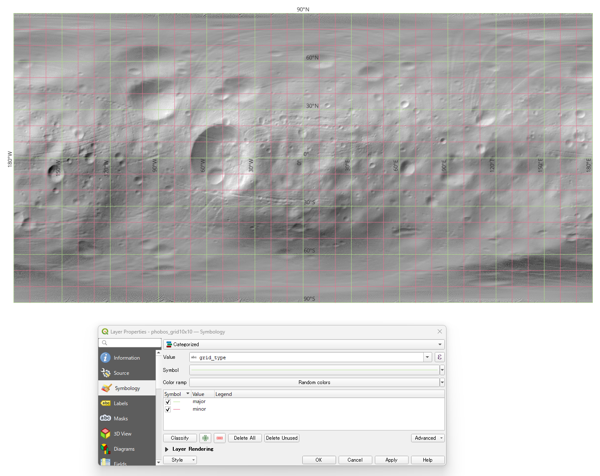
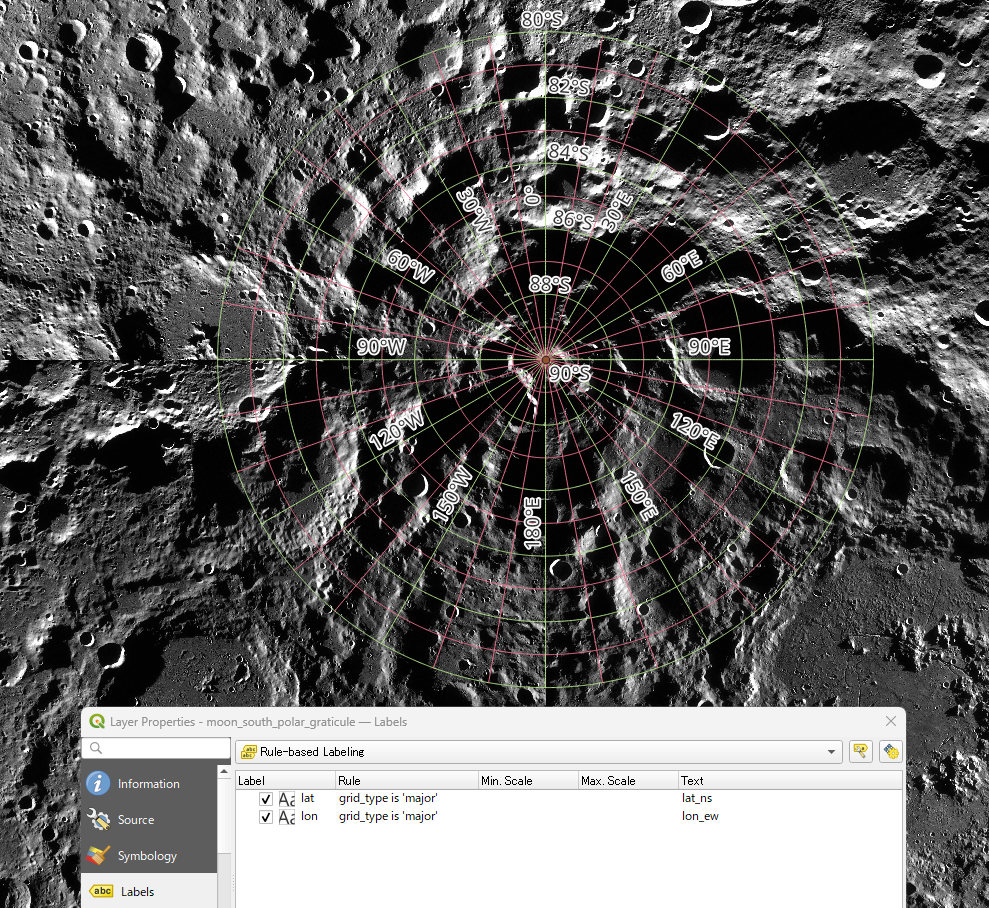
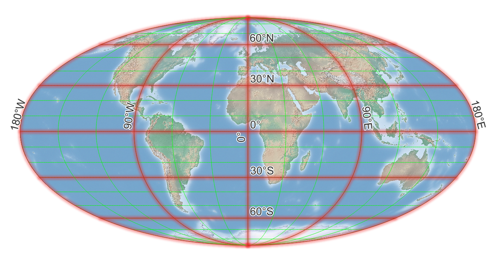

# QGIS examples

## Phobos example (with major/minor classification)

Example global graticule for **Phobos**, generated using major/minor classification.

Command:

```sh
mkgraticule -srs IAU_2015:40100 \
            -g 10 10 -m 30 30 \
            phobos_grid10x10
```



## Moon south polar stereographic example

Example graticule generated for the **Moon south polar stereographic projection**  
(`IAU_2015:30135`).

Because polar stereographic projections have a **limited valid domain**,  
the geographic extent is restricted to the south polar region.  
The `-nde` option is used to remove the duplicate endpoint meridian.

For this type of projection, the tool also writes a companion point layer (`point`), which can be used to display labels such as `90°S` at the projection center in QGIS.

Command:

```sh
mkgraticule -srs IAU_2015:30135 \
            -g 10 1 -m 30 2 \
            -e -180 -80 180 -90 -nde \
            moon_south_pole_graticule.gpkg
```



## Earth Mollweide example

Example global graticule for the **Earth** using the **World Mollweide projection**  
(`ESRI:54009`).

This example shows that the tool can also be used with non-IAU coordinate reference systems supported by GDAL / PROJ.

Command:

```sh
mkgraticule -srs ESRI:54009 \
            -g 30 10 \
            -m 90 30 \
            -e -180 90 180 -90 \
            earth_mollweide_graticule.gpkg
```


